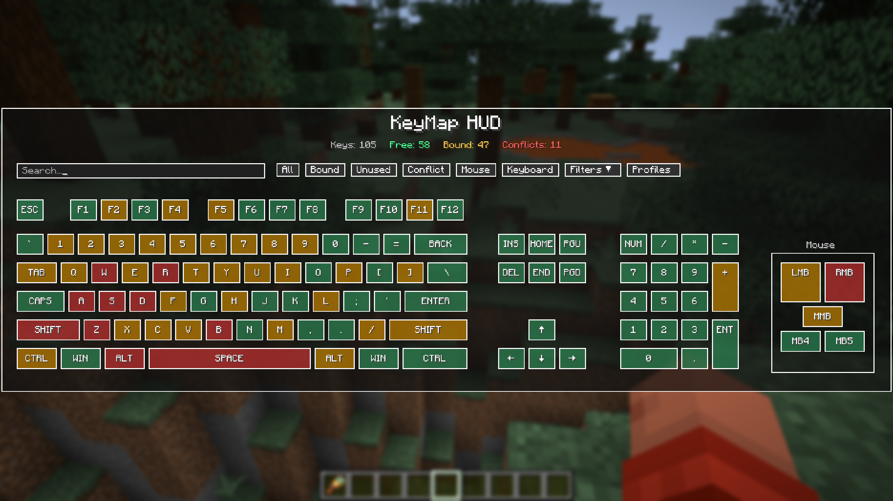
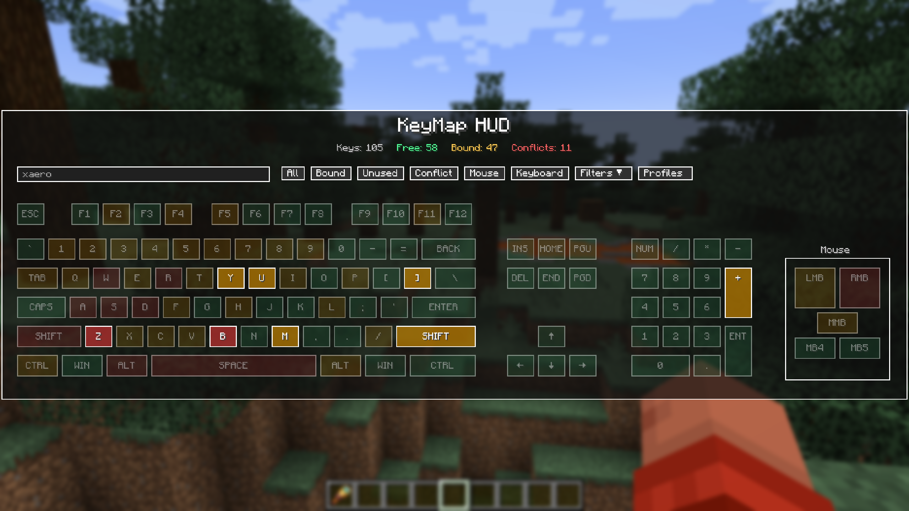
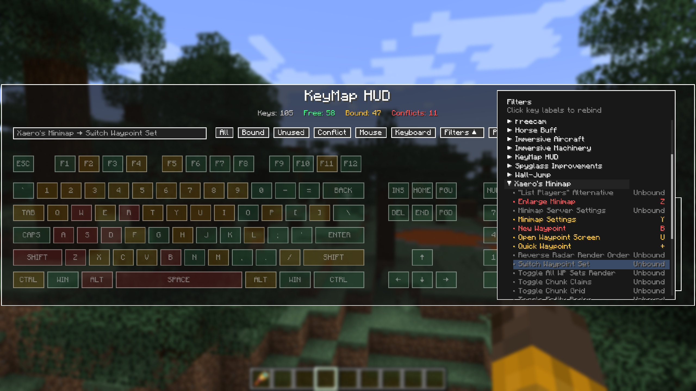
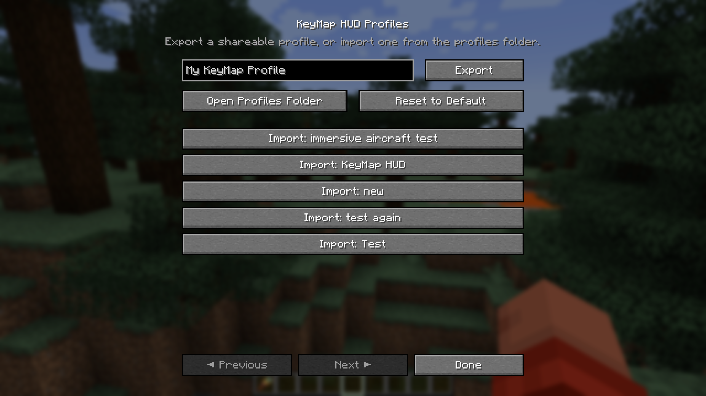
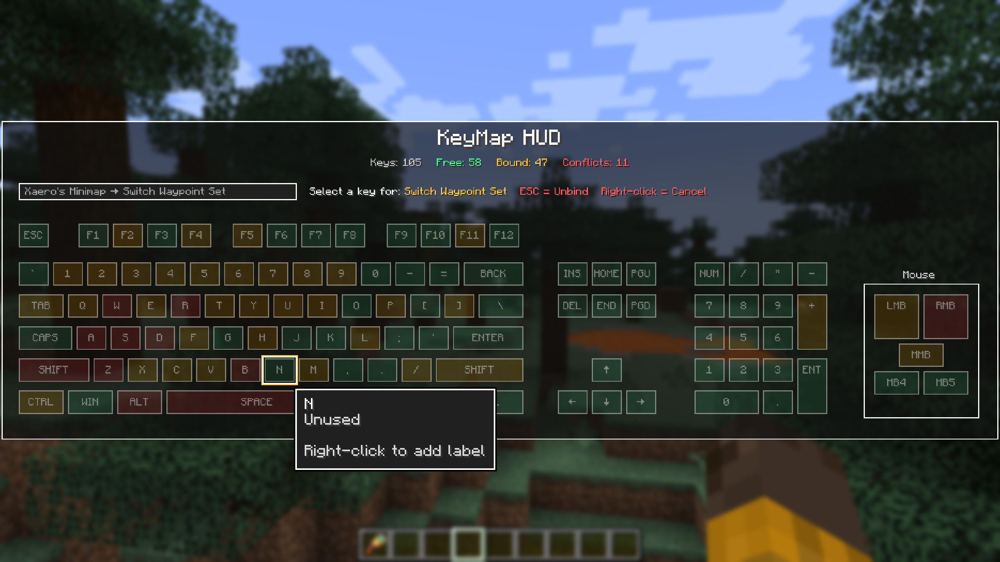
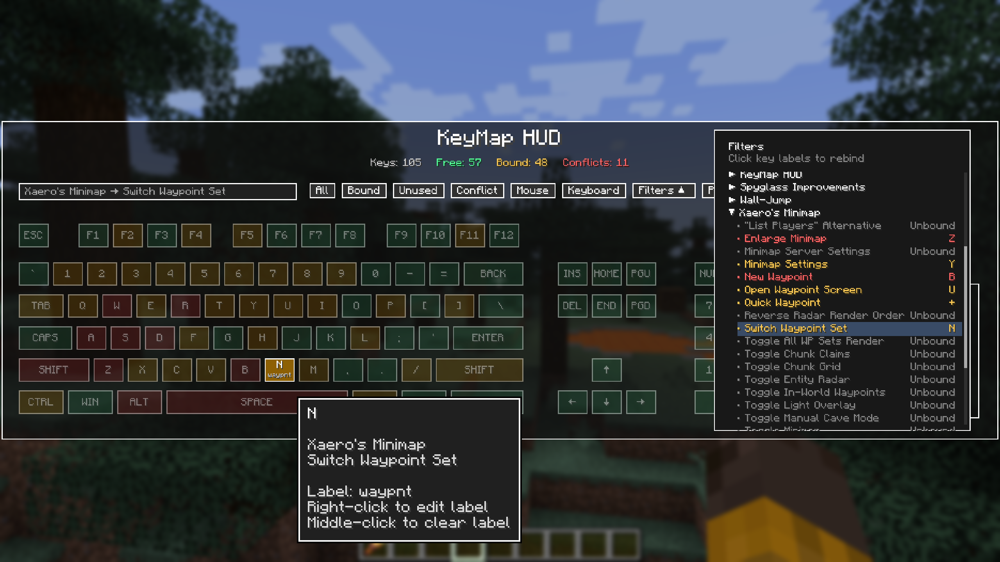

# KeyMap HUD

**A visual keybinding manager for Minecraft Fabric.**

KeyMap HUD provides an interactive keyboard and mouse overlay that makes it easy to see, understand, and manage your Minecraft keybindings. Quickly find conflicting keybinds, discover unused keys, search through actions, and organize different control setups with profiles.

> **Status:** KeyMap HUD is currently in development and has not yet been publicly released.

## Features

### Visual Keyboard & Mouse HUD

View your keybindings directly on a complete visual keyboard and mouse layout.

Keys are color-coded to make your controls easy to understand at a glance:

* **Green** — Unused key
* **Amber** — One action bound
* **Red** — Conflicting bindings

Hover over a key to see its assigned actions and additional information.

### Conflict Detection

Immediately identify keys assigned to multiple actions, making it much easier to resolve conflicts in large modpacks.

### Search & Filtering

Search your controls and filter keybindings by:

* Conflicts
* Free/unused keys
* Bound keys
* Mouse buttons
* Categories
* Individual mods

KeyMap HUD also supports search prefixes such as `mod:` and `cat:` for more targeted searches.

### Keybinding Profiles

Create and manage multiple keybinding profiles for different playstyles or mod setups.

Profiles can be:

* Created
* Renamed
* Duplicated
* Deleted
* Switched without manually rebuilding your entire control layout

### Key Rebinding

Select an action and visually choose the key you want to assign to it. Available keys are highlighted to make finding a good binding easier while still allowing you to intentionally create conflicting bindings when desired.

### Custom Key Labels

Give individual keys custom labels that appear directly on the KeyMap HUD keyboard.

Custom labels make it easy to identify important controls at a glance without needing to remember what every key is assigned to. Labels can be added, edited, or removed directly from the key tooltip and are saved as part of your KeyMap HUD configuration.

This is especially useful for large modpacks where a key's function may not be obvious from the key itself.

### Designed for Modded Minecraft

KeyMap HUD is especially useful for large modpacks where dozens—or even hundreds—of actions may compete for a limited number of convenient keys.

## Requirements

* Minecraft Java Edition
* Fabric Loader
* Fabric API
* Minecraft 1.21.1

Additional version support may be considered in the future.

## Installation

KeyMap HUD is not yet publicly released.

When available, official releases will be published through Modrinth.

## Development

KeyMap HUD is actively being developed and tested. Features and behavior may change before the first public release.

Bug reports and feature suggestions will be welcomed once the project reaches its initial public release.

## License

This project is licensed under the MIT License. See the `LICENSE` file for details.

## Support

If you enjoy my mods and would like to support future development, you can find **Itinerant Mods** on Ko-fi.

## Author

## Author

Created by **Itinerant Mods**.

[Ko-fi](https://ko-fi.com/itinerantmods) • [YouTube](https://youtube.com/@itinerantmods)
